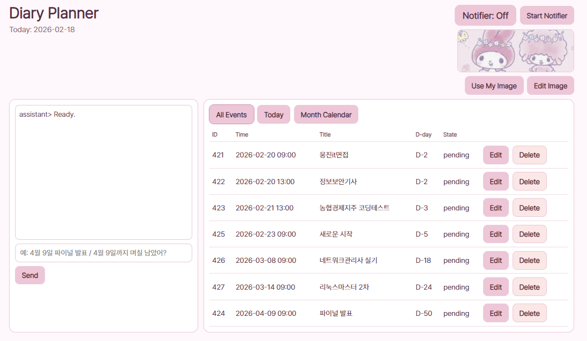
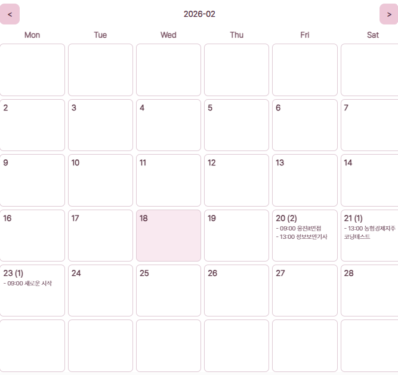
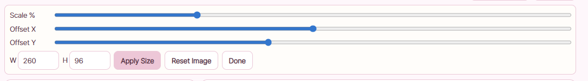

# Diary Schedule Assistant

자연어로 일정을 입력하면 등록/수정, D-day 계산, 월 달력 보기, 알림까지 처리하는 개인용 다이어리 플래너입니다.

## 주요 기능

- 자연어 일정 등록
- 동일 일정 자동 업데이트(중복 등록 방지)
- D-day 질의 응답
- 월 달력/오늘 일정/전체 일정 보기
- 일정 수정/삭제
- PC 알림(Notifier)
- 이미지 업로드 + 편집(크기/위치/스케일) + 설정 저장

## 실행 방법

### 1) 가장 쉬운 실행

- `launch_gui.bat` 더블클릭
- 브라우저가 자동으로 열리며 Web UI 실행

### 2) 수동 실행

```powershell
python -m venv .venv
.\.venv\Scripts\Activate.ps1
pip install -r requirements.txt
python webapp.py
```

브라우저 접속: `http://127.0.0.1:5842`

## 자연어 입력 가이드

앱 입력창에 아래처럼 입력하면 됩니다.

### 일정 등록

- `2월 20일 9시 면접, 1시 시험`
- `4월 9일 파이널 프로젝트 발표`
- `4월9일 오후 1시 파이널 프로젝트 발표`

### D-day 질문

- `4월 9일 파이널 프로젝트 발표까지 며칠 남았어?`
- `2026-04-09까지 몇일 남았어?`

### 일정 수정/업데이트 동작

같은 날짜 + 같은 제목(공백 차이 포함)으로 다시 입력하면 기존 일정을 업데이트합니다.

예:
- 먼저: `4월 9일 파이널 프로젝트 발표`
- 나중에: `4월 9일 오후 1시 파이널 프로젝트 발표`
- 결과: 같은 일정이 시간만 갱신됨(중복 추가 아님)

## Web UI 사용법

## 탭

- `All Events`: 전체 일정
- `Today`: 오늘 일정만
- `Month Calendar`: 월 달력

## 일정 편집

- 목록에서 `Edit` 클릭
- 제목/날짜/시간 수정 후 저장
- `Delete`로 삭제

## 알림

- `Start Notifier`: 알림 루프 시작
- `Stop Notifier`: 알림 루프 중지
- 일정 시간이 되면 PC 알림 표시

## 이미지 기능 (Use My Image / Edit Image)

### 업로드

1. `Use My Image` 클릭
2. PNG 파일 선택

### 편집

1. `Edit Image` 클릭
2. 아래 항목 조절
   - `Scale %`
   - `Offset X`
   - `Offset Y`
   - `W`, `H` (캔버스 크기)
3. `Done` 누르면 편집 패널 숨김

### 저장 방식

- 조절값은 자동 저장됩니다.
- 앱 재실행 후에도 유지됩니다.

저장 파일:
- 이미지: `assets/user_illustration.png`
- 설정: `web_settings.json`

## 바탕화면에서 바로 실행하기

1. `launch_gui.bat` 우클릭
2. `바로 가기 만들기`
3. 생성된 바로가기를 바탕화면으로 이동
4. 이후 바탕화면 아이콘 더블클릭으로 실행

## 아이콘/이름 변경 (선택)

바로가기 우클릭 -> `속성`에서:
- 이름: 예) `정연의 다이어리`
- 아이콘 변경: `아이콘 변경` 버튼으로 `.ico` 지정

## 프로젝트 파일

- `webapp.py`: Flask 서버/API
- `assistant.py`: 자연어 파싱/일정 로직
- `web/index.html`: Web UI
- `launch_gui.bat`: 원클릭 실행
- `schedule.db`: 일정 DB
- `assets/user_illustration.png`: 사용자 이미지
- `web_settings.json`: 이미지 레이아웃 설정

## 스크린샷


- `docs/screenshots/main.png` : 메인 화면
- `docs/screenshots/month-calendar.png` : 월 달력 화면
- `docs/screenshots/image-edit.png` : 이미지 업로드/편집 화면





### 스크린샷 추가 팁

- 저장 형식: PNG 권장
- 해상도: 가로 1400px 내외 권장
- 캡처 후 UI가 잘리지 않게 창을 최대화해서 촬영
